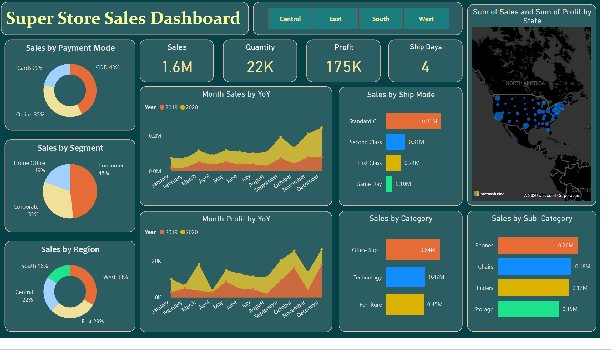
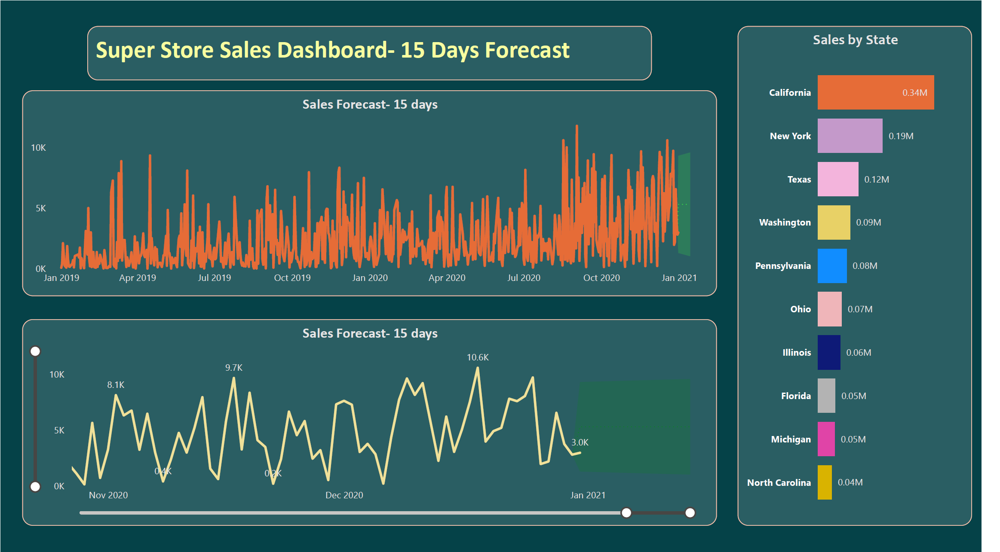

# 🛒 Super Store Sales Analysis – Power BI Dashboard

## 📌 Project Overview

This Power BI project presents an interactive Super Store Sales Analysis Dashboard designed to analyze sales performance, profitability, customer behavior, and regional trends. The dashboard consolidates transactional data to provide business stakeholders with clear, data-driven insights that support strategic decision-making.

Using Power BI features such as **DAX measures, data modeling, time intelligence, and forecasting**, the project visualizes key metrics including total sales, profit, quantity sold, shipping performance, and sales forecasts. The dashboard enables users to explore performance by category, sub-category, customer segment, region, state, shipping mode, and payment method.

The primary objective of this project is to identify revenue drivers, profit trends, customer preferences, and growth opportunities through intuitive and interactive visual analytics.

---

## 🎯 Business Objectives

* Monitor overall sales, profit, and operational performance
* Identify top-performing categories, products, and regions
* Analyze customer segments and payment behavior
* Track Year-over-Year (YoY) sales and profit trends
* Forecast short-term sales to support planning and decision-making

---

## 📊 Key KPIs

* **Total Sales:** $1.6M
* **Total Profit:** $175K
* **Total Quantity Sold:** 22K units
* **Average Shipping Time:** 4 days

---

## 🔍 Key Insights

* **Office Supplies** is the highest-performing category, followed by **Technology** and **Furniture**.
* **Phones, Chairs, and Binders** are the top-selling sub-categories.
* The **Consumer segment** contributes the largest share of revenue, highlighting strong B2C demand.
* The **West region** leads overall sales, with **California** as the top-performing state.
* **Standard Class** is the most preferred shipping mode, indicating cost-conscious customer behavior.
* **Cash on Delivery** remains the dominant payment method, while online payments show growing adoption.
* Year-over-Year analysis indicates **consistent growth from 2019 to 2020**.
* The **15-day sales forecast** predicts stable demand, supporting short-term operational planning.

---

## 📈 Summary of Findings

The Super Store demonstrates strong financial performance with balanced contributions across categories and regions. While consumer-driven sales dominate, corporate and home office segments present opportunities for expansion. Regional analysis highlights the West and East as strong markets, while Central and South regions offer untapped growth potential. Forecasting results suggest stable demand, enabling better inventory and logistics planning.

---

## 🧰 Tools & Technologies

* **Power BI Desktop** – Dashboard development & visualization
* **DAX** – Calculated measures, KPIs, and time intelligence
* **Power Query** – Data cleaning and transformation
* **Data Modeling** – Relationship management and schema design
* **Forecasting** – Short-term sales prediction

---

## 📂 Dataset

* Super Store transactional sales data
* Includes order details, customer segments, regions, categories, shipping, and payment modes

---

## 📌 Key Skills Demonstrated

* Business-focused data analysis
* Data modeling and transformation
* KPI design and storytelling with dashboards
* Time-series analysis and forecasting
* Stakeholder-ready reporting

---

## 🚀 How to Use the Dashboard

1. Download the `.pbix` file from the repository
2. Open it using **Power BI Desktop**
3. Use slicers to filter by year, region, category, and segment
4. Explore trends, KPIs, and forecasts interactively

---

⭐ *If you find this project useful, feel free to star the repository!*
